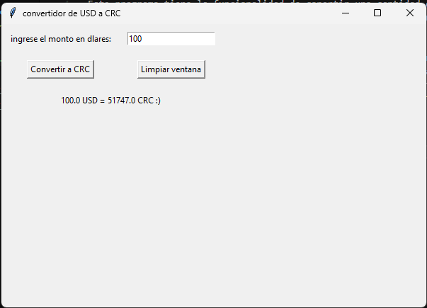
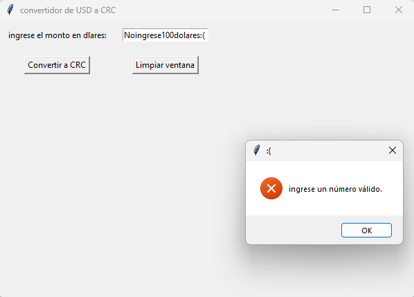
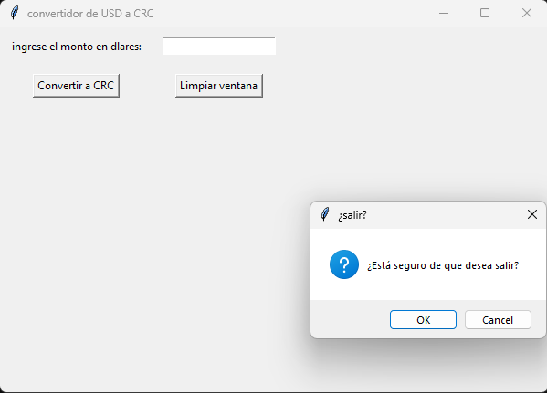

# Andrey Gamez Fajardo

### Descripcion del programa 
Este programa tiene la funcionalidad de conertir una cantidad dada de USD a CRC usando 
usando la conversion actualizada validando entradas y verificando acciones

### uso 
Para hacer uso del programa mediante la terminal se debe primero llegar al directorio
en donde se encuentra dicho script mediante la terminal utilizando el siguiente comando
"cd <nombre del directorio a acceder>", luego cuando se encuentre en dicho directorio 
deberá ejecutar el siguiente comando: python <nombre del script>.py

### Capturas del funcionamiento del programa
1.
    

2.
    

3.
    
